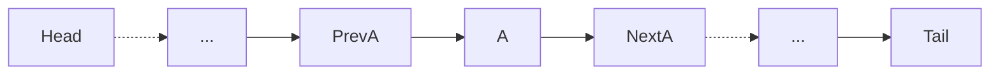
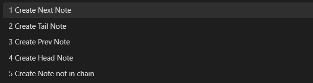
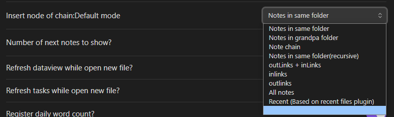
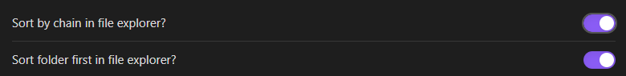
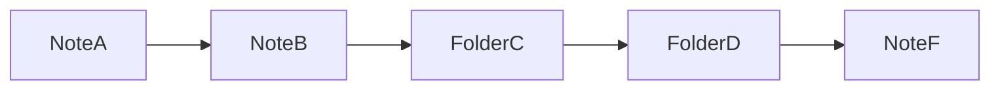
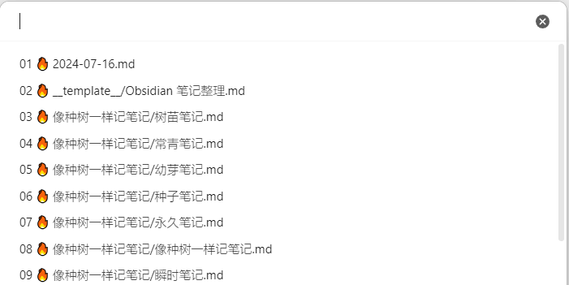

> Thoughts as river, notes as chain. Add prev and next notes to a notes, and order files by the chain in File Explorer.


## Why `Note Chain`

The modern note concept of dual-linking allows notes to think like the brain, in a mesh of thoughts. Like roots or river networks, they are scattered without missing any idea, and based on the internal links of the notes, we can easily pick up each idea.

However, when we finally decide to organize our views into articles and compile topics into books, we have to roll this net into a main line. So why not make a little effort for this from the start?	

When I stared at the messy drawers of notes like `Nicholas Bourbaki`, various drawers, all kinds of notes, titles, content, tags, references, and dates flickered in my mind, I realized:

> Linear output requires linear input.


For this reason, I call all notes arranged in order the note chain and developed the `Note Chain` plugin, aimed at adding a small piece to the puzzle of note management.

## How to Create a Note Chain?



`Note Chain` defines the pre-note and post-note of the current note through metadata `PrevNote` and `NextNote`. Through this relationship, notes on the same chain are linked together.

- Prev note: The note that precedes the current note;
- Next note: The note that follows the current note;
- Head note: The first note in the note chain;
- Tail note: The last note in the note chain;

`Note Chain` provides multiple commands to help create a note chain.

`Create New Note`: Create `pre/post/head/tail/non-chain` notes for the current note. Choose the type when creating, then enter the file name. If the file already exists, it will jump to that file. This command can replace the `Create New Note` command provided by `Obsidian`, and it is recommended to set the shortcut key to `Ctrl + N`;



`Move node up`: Move the current note up in the note chain, changing `A-B-C-D-E` to `A-C-B-D-E`. It is recommended to set the shortcut key to `Alt + PgUp`;

`Move node down`: Move the current note down in the note chain, changing `A-B-C-D-E` to `A-B-D-C-E`. It is recommended to set the shortcut key to `Alt + PgDn`;

`Insert node of chain`: Insert the current note into the note chain. First, select the note group according to different modes, then choose the note as the anchor point, and finally select the relationship between the current note and the anchor point. Since it is usually chosen for the same directory notes, you can select the default note group in the `Insert node of chain: Default mode` on the settings page. It is recommended to set the shortcut key to `Alt + I`.



`Files` in the file list also provides two commands to facilitate the creation of note chains:

- `Create next note`: Create a post-file for the current note;
- `Move as next note`: Set the current note or folder as a post-note for a certain note. For notes, select from all notes. For folders, only select notes in the same directory.

The methods introduced above are all for setting nodes for a single note. `Note Chain` also provides multiple commands to organize notes in the same folder.

`Reset the chain of current folder` will string all notes in the current note's folder into a note chain. You can create a note chain based on the file name `name`, creation time `ctme`, and modification time `mtime`, in ascending order (`a to z`) or descending order (`z to a`), which is suitable for initialization. You can also create a note chain based on the existing note chain `chain`, suitable for situations where there are multiple note chains in a directory.

`Reset note chain by longform` and `Reset longform scenes by note chain` are a set of mutually reinforcing commands, which correspond the note chain of the current folder notes to the scenes of the [[LongForm]] plugin. `Reset longform scenes by note chain` generates `longform` project metadata in the folder's namesake note and sets the current note chain as its scene. You can move the order of individual or multiple notes in the metadata with `Move line down` and `Move line up`, or cut notes to a specified location. Then, set the corresponding note chain with `Reset note chain by longform`. This set of commands can make it more convenient to organize notes.

`Note Chain 1.0.7` also supports automatic reshaping of note chains in the folder. Check `Auto build notechain of folder while open new file` on the `Settings` page, when opening a note, the notes in the current folder will be automatically strung into a note chain, similar to automatically executing `Reset the chain of current folder` with `chain`. If some folders do not need to be automatically reshaped, you can enter the folders to skip in `Ignore these folder`, and multiple folders are separated by line breaks.

## `Files'` Sorting Rules

After setting the note chain, turn on `Sort by chain in file explorer` on the settings page, and the files in the `Files` list will be sorted in the order of the note chain.



### Note Sorting Rules

`markdown` note (including `Excalidraw`) sorting rules:

1. For each directory in the `File List`, obtain the file and folder sorting `A`;
2. Initialize a new sorting `B`;
3. For the first note in `A`, obtain its note chain `C`;
4. Update `A` and `B`: `B=B+A∩C`, `A=A-A∩C`.
5. Repeat step 3 until there are no `md` notes in `A`;
6. Get the note sequence `B`;

### Folder Sorting Rules

Folder sorting rules:

1. The note index value in the note sequence `B` is `0, 1, 2, ...`;
2. The default index for folders is `-1`;
3. If the folder's namesake note has set the metadata `FolderPrevNote` and `FolderPrevNoteOffset`:
   - `FolderPrevNote` is the anchor note;
   - `FolderPrevNoteOffset` is a number, the default is `0.5`;
   - The directory index value is: `FolderPrevNote + FolderPrevNoteOffset`;
4. Sort files and folders by index;

For example, set the following metadata for `Folder C` and `Folder D`:
- `Folder C`: `FolderPrevNote: "[[Note B]]"`, `FolderPrevNoteOffset: 0.2`;
- `Folder D`: `FolderPrevNote: "[[Note B]]"`, `FolderPrevNoteOffset: 0.6`;

The sorting in the `Files` list is:



Set folder sorting, in the `Files/Files` list, right-click the directory, and click `Move as next note`, choose after which note.

### `canvas` Whiteboard Sorting Rules

`canvas` whiteboards cannot set pre and post notes, and it is already a file, creating a namesake note for it like a folder feels redundant. But I suddenly thought, it is often after having notes that there is a need for a whiteboard. So, the sorting rule for the whiteboard is:

1. Create a namesake whiteboard after the note, i.e., the whiteboard is arranged after the namesake note;
2. If a note requires multiple whiteboards, the new whiteboard is named according to `Note filename.xxx`, i.e., the whiteboard is arranged after the note corresponding to the last `.` cut off in the filename;

## Quick Access

`Note Chain` provides multiple commands for more convenient access to notes.

`Open note`: Open the note. All notes are sorted by modification time and can be accessed through numerical encoding.



`Open and reveal note`: Open and locate the note, the note will be displayed in the middle of the `File List`;

`Reveal current file in navigation`: Locate the note in the `File List`, the note is centered when displayed, which can replace the system's own command;

`Open note smarter`: First select the note group, then select the note.


`Move current file to another folder`: Move the current note, the folder is sorted according to the latest modification time of the note, so it is prioritized to move to the active directory.

`Open prev note`: Open the pre-note, it is recommended to set the shortcut key to `Alt+←`;

`Open next note`: Open the post-note, it is recommended to set the shortcut key to `Alt+→`;

`Open prev note of right leaf`: Open the pre-note of the right page;

`Open next note of right leaf`: Open the post-note of the right page;

The last two commands are suitable for linked notes, and specific examples are [here](http://mp.weixin.qq.com/s?__biz=MzI5MzMxMTU1OQ==&mid=2247486786&idx=1&sn=bda7acb189427ab44690e04289658225&chksm=ec75486adb02c17c64b9193c01197f6b44d57649d21fdc0f4f2dbbb5ec3823d862bf22acc4c8#rd)

## Other Features

### Settings Page

`Refresh dataview while open new file`: Whether to refresh `dataview` when opening a new note;

`Refresh tasks while open new file`: Whether to refresh `task` when opening a new note.

### Word Count

`Register daily word count`: Whether to record the word count of the note for the day when modifying the note, the word count is similar to the core plugin `Word Count`. This feature can track the output of notes.

```js
let nc = app.plugins.getPlugin('note-chain');
let note = nc.chain.current_note;
// Get the number of words updated for the note on a specific date
nc.wordcout.get_new_words(note,'2024-07-15')
```

### Utility Functions

```js
let nc = app.plugins.getPlugin('note-chain');
```

> `let note = nc.chain.get_last_daily_note()`

Get the most recently accessed log note, the priority is: whether the current page is a log note, whether the right page is a log note, the first log note in the history.

> `let leaf = nc.chain.get_neighbor_leaf(offset=-1)`

Get the left or right page of the current note, `offset` is negative for the left, positive for the right. `leaf.view.file` is the corresponding note.

> `let note = await nc.chain.sugguster_note()`

Select a note from the library.

> `let func = nc.utils.get_tp_func(app, "tp.system.prompt")`

Get the function provided by the `Templater` plugin;

> `let func = await nc.utils.get_tp_func(app, "tp.user.func")`

Get the user-defined function of the `Templater` plugin;

## Installation

Note Chain depends on the following plugins:
- [[Templater]] + [[DataView]] + [[Recent Files]] + [[Tasks]]

### Install from the Plugin Community

1. In Obsidian, `ctrl+,` to open `Settings`;
2. Click `Browse` in `Community Plugins`;
4. Search and select `Note Chain`;
5. Click Install and Enable;

You can also install from [obsidian plugins note-chain](https://obsidian.md/plugins?search=note-chain).

### Manual Installation

1. Click on the latest [release page](https://github.com/zigholding/obsidian-notechain-plugin/releases), download `main.js`, `manifest.json`, and `styles.css` (or a zip file);
2. Copy the files to your `obsidian` library `[your vault]/.obsidian/plugins/note-chain/`;
3. Restart `Obsidian` or refresh the plugin list, and you will see this plugin;
4. In the plugin list, enable `Note Chain`;

You can also download these files from [Baidu Cloud Disk](https://pan.baidu.com/s/1mR71B9lLE9CgZwcnfyLOEg?pwd=khum).

