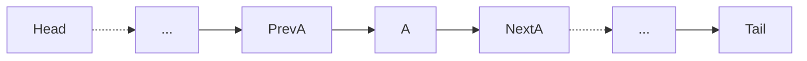
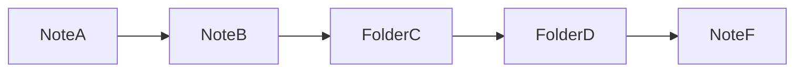

> Thoughts as river, notes as chain. Sort and indent notes in File Explorer, expose MCP/EasyAPI, and automate AI chats in Web Viewer.


## Why `Note Chain`

The modern note concept of dual-linking allows notes to think like the brain, in a mesh of thoughts. Like roots or river networks, they are scattered without missing any idea, and based on the internal links of the notes, we can easily pick up each idea.

However, when we finally decide to organize our views into articles and compile topics into books, we have to roll this net into a main line. So why not make a little effort for this from the start?

When I stared at the messy drawers of notes like `Nicholas Bourbaki`, various drawers, all kinds of notes, titles, content, tags, references, and dates flickered in my mind, I realized:

> Linear output requires linear input.


For this reason, I call all notes arranged in order the note chain and developed the `Note Chain` plugin, aimed at adding a small piece to the puzzle of note management.

## How to Create a Note Chain?


```mermaid
graph LR

Head -.-> P[...] --> PrevA --> A --> NextA -.-> N[...] --> Tail
```

`Note Chain` defines the pre-note and post-note of the current note through metadata `PrevNote` and `NextNote` (field names are configurable). Through this relationship, notes on the same chain are linked together.

- Prev note: The note that precedes the current note;
- Next note: The note that follows the current note;
- Head note: The first note in the note chain;
- Tail note: The last note in the note chain;

`Note Chain` provides multiple commands to help create a note chain.

`Create New Note`: Create `pre/post/head/tail/non-chain` notes for the current note. Choose the type when creating, then enter the file name. If the file already exists, it will jump to that file. This command can replace the `Create New Note` command provided by `Obsidian`, and it is recommended to set the shortcut key to `Ctrl + N`;


`Move node up`: Move the current note up in the note chain, changing `A-B-C-D-E` to `A-C-B-D-E`. It is recommended to set the shortcut key to `Alt + PgUp`;

`Move node down`: Move the current note down in the note chain, changing `A-B-C-D-E` to `A-B-D-C-E`. It is recommended to set the shortcut key to `Alt + PgDn`;

`Insert node of chain`: Insert the current note into the note chain. First, select the note group according to different modes, then choose the note as the anchor point, and finally select the relationship between the current note and the anchor point. Since it is usually chosen for the same directory notes, you can select the default note group in the `Insert node of chain: Default mode` on the settings page. It is recommended to set the shortcut key to `Alt + I`.


`Files` in the file list also provides commands to facilitate the creation of note chains:

- `Create next note`: Create a post-file for the current note;
- `Move as next note`: Set the current note or folder as a post-note for a certain note. For notes, select from all notes. For folders, only select notes in the same directory;
- `Move as next notes (selected)`: Chain multiple selected notes as next notes.

The methods introduced above are all for setting nodes for a single note. `Note Chain` also provides multiple commands to organize notes in the same folder.

`Rebuild the chain of current folder` will string all notes in the current note's folder into a note chain. You can create a note chain based on the file name `name`, creation time `ctime`, and modification time `mtime`, in ascending order (`a to z`) or descending order (`z to a`), which is suitable for initialization. You can also create a note chain based on the existing note chain `chain`, suitable for situations where there are multiple note chains in a directory.

`Reset note chain by longform` and `Reset longform scenes by note chain` are a set of mutually reinforcing commands, which correspond the note chain of the current folder notes to the scenes of the `LongForm` plugin. `Reset longform scenes by note chain` generates `longform` project metadata in the folder's namesake note and sets the current note chain as its scene. You can move the order of individual or multiple notes in the metadata with `Move line down` and `Move line up`, or cut notes to a specified location. Then, set the corresponding note chain with `Reset note chain by longform`. Nested LongForm scenes also sync indentation levels (`notechain.level`).

Enable `On create/move into a folder, link notes not yet in the chain?` on the Settings page: when a note is created or moved into a folder, notes that are not yet in any chain can be appended automatically (existing chains are not reshaped). Use `Ignore these folders` under word-count settings to skip folders where needed.

## Hierarchical Indentation

Beyond linear order, notes can show hierarchy in File Explorer via Confluence-style indentation stored in frontmatter `notechain.level` (a string of tab characters `\t`).

- `Increase the indentation level` — recommended hotkey `Mod+Shift+L`
- `Decrease the indentation level` — recommended hotkey `Mod+Shift+J`
- `Remove the indentation level` — recommended hotkey `Mod+Shift+K`

Indentation is prefixed to the File Explorer display name. LongForm scene nesting and note-chain level stay in sync when you use the LongForm ↔ chain commands.

## `Files'` Sorting Rules

After setting the note chain, turn on `Sort by chain in file explorer` on the settings page, and the files in the `Files` list will be sorted in the order of the note chain.


Optional explorer behaviors:

- `Sort folder first in file explorer?` — folders before files when sorting;
- `Sort files by drag & drop?` — drag a note in File Explorer to reorder the chain.

### Note Sorting Rules

`markdown` note (including `Excalidraw`) sorting rules:

1. For each directory in the `File List`, obtain the file and folder sorting `A`;
2. Initialize a new sorting `B`;
3. For the first note in `A`, obtain its note chain `C`;
4. Update `A` and `B`: `B=B+A∩C`, `A=A-A∩C`.
5. Repeat step 3 until there are no `md` notes in `A`;
6. Get the note sequence `B`;

### Folder Sorting Rules

Folder sorting rules:

1. The note index value in the note sequence `B` is `0, 1, 2, ...`;
2. The default index for folders is `-1`;
3. If the folder's namesake note has set the metadata `FolderPrevNote` and `FolderPrevNoteOffset`:
   - `FolderPrevNote` is the anchor note;
   - `FolderPrevNoteOffset` is a number, the default is `0.5`;
   - The directory index value is: `FolderPrevNote + FolderPrevNoteOffset`;
4. Sort files and folders by index;

For example, set the following metadata for `Folder C` and `Folder D`:
- `Folder C`: `FolderPrevNote: "[[Note B]]"`, `FolderPrevNoteOffset: 0.2`;
- `Folder D`: `FolderPrevNote: "[[Note B]]"`, `FolderPrevNoteOffset: 0.6`;

The sorting in the `Files` list is:


```mermaid
graph LR
NoteA --> NoteB --> FolderC --> FolderD --> NoteF
```

Set folder sorting, in the `Files/Files` list, right-click the directory, and click `Move as next note`, choose after which note.

### Display Text & Style

Customize how notes appear in File Explorer:

- `notechain.display` — display template. Placeholders use `<field>` syntax:
  - `<$0>` — original file name / basename;
  - `<title|alias|$0>` — first non-empty frontmatter field, else basename;
  - `<?($1)>` style suffix — when a value exists, wrap it (e.g. `<title?「$1」>`);
  - Indentation from `notechain.level` is always applied in front of the template.
- `notechain.style` — File Explorer item style: a CSS color string, a style object, or a function name resolved via EasyAPI. Use `Set background color field via color picker` to write a color quickly.

### `canvas` Whiteboard Sorting Rules

`canvas` whiteboards cannot set pre and post notes, and it is already a file, creating a namesake note for it like a folder feels redundant. But I suddenly thought, it is often after having notes that there is a need for a whiteboard. So, the sorting rule for the whiteboard is:

1. Create a namesake whiteboard after the note, i.e., the whiteboard is arranged after the namesake note;
2. If a note requires multiple whiteboards, the new whiteboard is named according to `Note filename.xxx`, i.e., the whiteboard is arranged after the note corresponding to the last `.` cut off in the filename;

## Quick Access

`Note Chain` provides multiple commands for more convenient access to notes.

`Open note`: Open the note. All notes are sorted by modification time and can be accessed through numerical encoding.


`Open and reveal note`: Open and locate the note, the note will be displayed in the middle of the `File List`;

`Reveal current file in navigation`: Locate the note in the `File List`, the note is centered when displayed, which can replace the system's own command;

`Open note smarter`: First select the note group, then select the note.


`Move current file to another folder`: Move the current note, the folder is sorted according to the latest modification time of the note, so it is prioritized to move to the active directory.

`Open prev note`: Open the pre-note, it is recommended to set the shortcut key to `Alt+←`;

`Open next note`: Open the post-note, it is recommended to set the shortcut key to `Alt+→`;

`Open prev note of right leaf`: Open the pre-note of the right page;

`Open next note of right leaf`: Open the post-note of the right page;

The last two commands are suitable for linked notes, and specific examples are [here](http://mp.weixin.qq.com/s?__biz=MzI5MzMxMTU1OQ==&mid=2247486786&idx=1&sn=bda7acb189427ab44690e04289658225&chksm=ec75486adb02c17c64b9193c01197f6b44d57649d21fdc0f4f2dbbb5ec3823d862bf22acc4c8#rd)

Other handy commands:

- `Open note in modal` / `Open note in view` — preview a note in a modal or custom view;
- `Execute current note` — run Templater JS / extract CSS / open as modal (`Alt+R` recommended);
- `Execute Templater modal` — pick a script note and insert its output;
- `Mermaid of notes` / linked / folder — generate Mermaid flowcharts;
- `Toogle css block in note` — enable or disable a CSS code block in the note;
- `Set frontmatter for selected notes` — batch set properties;
- `Replace by regex` — regex replace across notes;
- Desktop: `File - open with system app`, `File - show in system explorer`, `File - rename file`.

## `textarea` Code Blocks

In reading view, fenced blocks with language `textarea` become interactive panels (YAML config + optional text area + button rows):

````markdown
```textarea
textarea:
  style:
    height: 120px
buttons:
  - Clear: clear_area
  - Copy: copy_area
  - Run: my_templater_func
```
````

- Frontmatter of the host note is merged into the config unless `frontmatter: false`;
- Buttons can call built-ins (`clear_area`, `copy_area`, `log_area`), Templater/CustomJS functions, Obsidian commands, or script notes;
- Wiki-link autocomplete (`[[`) works inside the textarea;
- Online vault can run button actions via `/online/api/textarea-exec`.

## Local HTTP Server (Desktop)

Settings → **Note Chain** tab → enable the server. You can turn on HTTPS and/or HTTP independently.

| Option | Role |
|--------|------|
| `Enable server` | Master switch |
| `HTTPS (mobile / LAN)` | Self-signed TLS; phone/LAN access, e.g. `https://IP:3000/oldbuddy` |
| `HTTP localhost (Obsidian WebViewer)` | Local HTTP for Web Viewer; when HTTPS is also on, HTTP uses `HTTPS port + 1` |
| `Listen Host` / `HTTPS port` | Shared host; default `0.0.0.0` / `3000` |

### MCP for Agents

Note Chain exposes vault tools over MCP so Cursor / other agents can call Obsidian workflows.

Tools are defined in the vault (Templater scripts): prefer `obsidian_mcp_list_tools.md`, or notes with frontmatter `mcp_tool` / names like `mcp_*`. Calling a tool runs the matching `{name}.md` through Templater.

| Endpoint | Purpose |
|----------|---------|
| `/mcp/list_tools` | List tools |
| `/mcp/call_tool` | Call a tool `{ name, arguments }` |
| `/sse` + `/messages` | MCP SSE / JSON-RPC |
| `/mcp/test` | Browser test page |
| `/mcp/skill` | Generated Agent `SKILL.md` |
| `/templater` | Run a Templater script remotely |

Command `Generate MCP Agent Skill (SKILL.md)` saves a ready-to-use skill document for agents.

### Online Vault

Browse and edit vault markdown from a browser at `/online` (search, read/save, render, media, textarea-exec APIs under `/online/api/*`).

### OldBuddy

Local chat companion UI at `/oldbuddy` (WebSocket + message APIs). Command `Open OldBuddy in Web Viewer` opens it inside Obsidian Web Viewer (requires HTTP enabled).

## WebViewer LLM

Automate AI chats inside Obsidian **Web Viewer** via selector-driven profiles.

Supported sites: Yuanbao, ChatGPT, Kimi, Doubao, DeepSeek, ChatGLM, Gemini, Claude.

Useful commands:

- `WebviewLLM: Chat with Target File` — build a prompt from a template note and send (`Alt+F` recommended);
- `WebviewLLM: New AI Chat` / send to first or all models;
- Start / stop continuous chat;
- Paste last AI content; paste as tab/card list;
- Probe elements / copy active AI profile snippet (for maintaining selectors).

Prompt templates support placeholders such as `${selection}`, `${tfile.content}`, `${[[Note]]}`, `${prompt.xxx}`, optional reference notes, and Templater pre/post-process. See [cmd_chat_with_target_tfile 用法.md](./cmd_chat_with_target_tfile%20用法.md) for details.

Settings live under the **Web viewer AI** tab (prompt tag filter, reference notes, clipboard, pre/post-process, auto-stop phrases, HTML→Markdown styles).

## Other Features

### Settings Page

Two tabs: **Note Chain** and **Web viewer AI**.

Common Note Chain options also include:

- `Refresh dataview while open new file?` / `Refresh tasks while open new file?`;
- `Notice while modify note chain?`;
- Configurable frontmatter field names for prev/next/display/level/style;
- `Tags or folder of script note` — where script notes for Templater / MCP live;
- `Avata` — avatar field name used by related UIs.

### Word Count

`Register daily word count`: Whether to record the word count of the note for the day when modifying the note, the word count is similar to the core plugin `Word Count`. This feature can track the output of notes. Skip folders via `Ignore these folders`.

```js
let nc = app.plugins.getPlugin('note-chain');
let note = nc.chain.current_note;
// Get the number of words updated for the note on a specific date
nc.wordcount.get_new_words(note,'2024-07-15')
```

### EasyAPI & Utility Functions

`Note Chain` exposes `window.ea` (EasyAPI) for Templater / Dataview / scripts: file helpers, editor/frontmatter, dialogs (suggest, multi-suggest, prompt, cards, calendar, color), Templater runner, time/random/web/fs utilities, plus shortcuts such as `ea.nc`, `ea.wv`, `ea.dv`, `ea.cfile`.

```js
let nc = app.plugins.getPlugin('note-chain');
let ea = window.ea;
```

> `let note = nc.chain.get_last_daily_note()`

Get the most recently accessed log note, the priority is: whether the current page is a log note, whether the right page is a log note, the first log note in the history.

> `let leaf = nc.chain.get_neighbor_leaf(offset=-1)`

Get the left or right page of the current note, `offset` is negative for the left, positive for the right. `leaf.view.file` is the corresponding note.

> `let note = await nc.chain.sugguster_note()`

Select a note from the library.

> `let func = nc.utils.get_tp_func(app, "tp.system.prompt")`

Get the function provided by the `Templater` plugin;

> `let func = await nc.utils.get_tp_func(app, "tp.user.func")`

Get the user-defined function of the `Templater` plugin;

## Installation

Note Chain works best with:

- `Templater` + `Dataview` + `Recent Files` + `Tasks`
- Obsidian core **Web Viewer** (for WebViewer LLM / OldBuddy in-app)
- Optional: `LongForm` for scene ↔ chain sync

### Install from the Plugin Community

1. In Obsidian, `ctrl+,` to open `Settings`;
2. Click `Browse` in `Community Plugins`;
3. Search and select `Note Chain`;
4. Click Install and Enable;

You can also install from [obsidian plugins note-chain](https://obsidian.md/plugins?search=note-chain).

### Manual Installation

1. Click on the latest [release page](https://github.com/zigholding/obsidian-notechain-plugin/releases), download `main.js`, `manifest.json`, and `styles.css` (or a zip file);
2. Copy the files to your `obsidian` library `[your vault]/.obsidian/plugins/note-chain/`;
3. Restart `Obsidian` or refresh the plugin list, and you will see this plugin;
4. In the plugin list, enable `Note Chain`;

You can also download these files from [Baidu Cloud Disk](https://pan.baidu.com/s/1mR71B9lLE9CgZwcnfyLOEg?pwd=khum).

