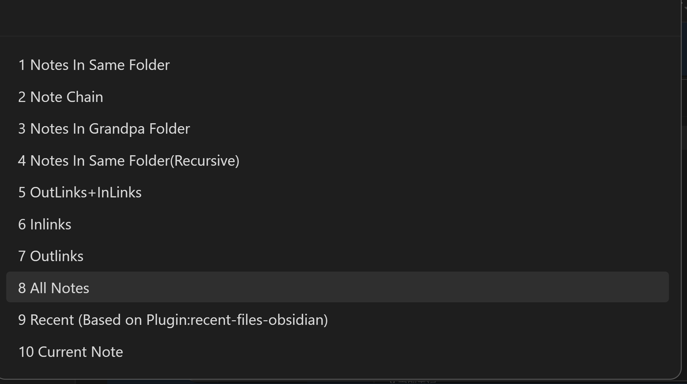

## English

Why make this plug-in? 

With the in-depth use of card box notes, I think its core is: linear output requires linear input. I need a plug-in that can connect all my notes like a chain. Add a small piece of the puzzle to the world of note management.

Notes use metadata `PrevNote` and `NextNote` to define the previous notes and next notes of the current note. Through this relationship, string notes together that you think are on the same chain. You can do this by:
- `Note Chain: Open prev note`: Open prev note, recommended shortcut key `Alt+←`;
- `Note Chain: Open next note`: Open next note, recommended shortcut key `Alt+→`;

Currently, the plug-in provides three ways to help set up note chains.

> [!NOTE]- `Insert node of chain`
> > Set the node for the current note.
> 1. Select node type
> 
> 2. Select node notes
> 
> 3. Select node relationship
> 

> [!NOTE]- `Reset Note Chain by LongForm`
> 1. First, install LongForm to create a new project and sort the notes;
> 
> 2. Call the `longform` metadata note and execute the command. The preceding and following notes will be set according to the order of `scenes` + `ignored`;

> [!NOTE]- `Reset the chain of current folder!`
> 1. Select chain type. Except for `chain`, which is expanded on the current sequence, other options have the original structure;
> - `chain`: Sort by file name first, then by the set chain;
> - `name`: sort by file name;
> - `ctime`: Sort by creation time;
> - `mtime`: Sort by modification time;
> 

Now that you have completed setting up the note chain, experience the fun of browsing in the directory. Turn on the `Sort File Exploter` option in the settings page. You will find that the files in the directory have been sorted by note chains. This will invalidate existing sorting functionality.

## 中文

为什么做这个插件？

随着卡片盒笔记的深入使用，我认为其核心是：线性的输入，需要线性的输出。我需要一个插件，像链条一样，串起所有的笔记。补上笔记管理世界的一块小拼图。

笔记使用元数据 `PrevNote` 和 `NextNote` 定义当前笔记的前置笔记和后置笔记。通过这种关系，将你认为处于同一链条上的笔记串链在一起。你可以通过：
- `Note Chain：Open prev note`：打开前置笔记，推荐快捷键  `Alt+←`；
- `Note Chain：Open next note`：打开后置笔记，推荐快捷键 `Alt+→`；

目前，插件提供了三种方式帮助设置笔记链条。

> [!NOTE]- `Insert node of chain`
> 
> 为当前笔记设置节点。
> 1. 选择节点类型
> 
> 2. 选择节点笔记
> 
> 3. 选择节点关系
> 

> [!NOTE]- `Reset Note Chain by LongForm`
> 1. 首先，安装 LongForm 新建项目，对笔记排序；
> 
> 2. 打来 `longform` 元数据笔记，执行命令。将会根据 `scenes` + `ignored` 的顺序，设置前后置笔记；

> [!NOTE]- `Reset the chain of current folder!`
> 1. 选择链条类型。除了 `chain` 是在当前顺序上拓展外，其它选项都有在外原有结构；
> 	- `chain`：先按文件名排序，再按已设置链条排序；
> 	- `name`：按文件名排序；
> 	- `ctime`：按创建时间排序；
> 	- `mtime`：按修改时间排序；
> 

现在，你已经完成了笔记链条的设置，体验在目录中浏览的乐趣吧。在设置页面中打开 `Sort File Exploter` 选项。你会发现，目录中的文件已经按笔记链条排序了。这会让已有的排序功能失效。

也许你注意到了 `Sort Folder First`？是的，如果目录中同时有文件夹和文件，优先目录，之后笔记。关闭选项后，并不是说将文件夹排到最后。而是，根据通设置目录的同名笔记 `FolderPrevNote` 来确定放在哪条笔记后面。

`[[anchor]]+0.5` 表示位置在 `anchor` 笔记后面 0.5。

通过 `Insert node of chain` -> `3上级笔记` -> `选择笔记` --> `insert Folder After` 排序。

