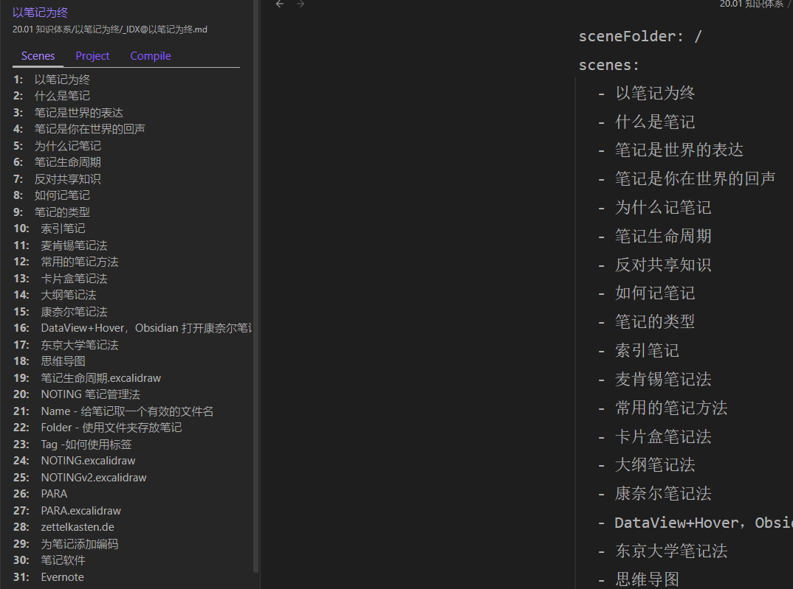

## Why

Why make this plug-in? 

With the in-depth use of card box notes, I think its core is: linear output requires linear input. I need a plug-in that can connect all my notes like a chain. Add a small piece of the puzzle to the world of note management.

Notes use metadata `PrevNote` and `NextNote` to define the previous notes and next notes of the current note. Through this relationship, string notes together that you think are on the same chain. 

These plugins are needed to install:
- [[Templater]] + [[DataView]] + [[Recent Files]] + [[Tasks]]

## Connect&Open

`Note Chain: Create New Note`：Create Prev/Next/Tail/Head Note relative to current note.

`Note Chain: Open prev note`: Open prev note, recommended shortcut key `Alt+←`;

`Note Chain: Open next note`: Open next note, recommended shortcut key `Alt+→`;

`Note Chain: Open note`: Select a note from notes sorted by modify time.

`Note Chain: Open note smarter`: First select the group of notes, then select and open note.

## Build Chain

NoteChain provides three ways to help set up note chains for multiple notes.

`NoteChai: Insert node of chain`：
1. Select the group of notes
2. Select node note
3. Select node relationship

First two steps are same as `Open note smarter`. After select a node note, select the relation between current note to anchor. `Folder As Next` is used to set the Prev Note for the parent of current note. 

I recommend to set frontmatter of folder-note(with same name to folder)：
- `FolderPrevNote: "[[PrevNoteName]]+0.5"`

For example, you can set `FolderPrevNote` for FlolderC and FolderD to sort them in `file-explor`：
- `FolderC`：`FolderPrevNote: "[[noteB]]+0.2"`
- `FolderD`：`FolderPrevNote: "[[noteB]]+0.6"`

`Reset Note Chain by LongForm`：
1. Install LongForm to create a new project and sort the notes.
2. Open the notes with frontmatter `longform`
3. Run this command and Set note chain by the sequence of  `scenes` + `ignored`;

`Reset the chain of current folder!`：Select mode to set prev/next note sequencely.
- `chain`: Sort by file name first, then sort by the exsited chain
- `name`: sort by file name. This is used for Daily Note.
- `ctime`: Sort by creation time
- `mtime`: Sort by modification time

`name/ctime/mtime` will reset your setting prev/next notes!

## `File-Explorer`

Now that you have completed setting up the note chain, experience the fun of browsing in the directory. Turn on the `Sort File Exploter` option in the settings page. You will find that the files in the directory have been sorted by note chains. This will invalidate existing sorting functionality.

## `Setting`

If you set `Insert node of chain:Default Mode`, when run `Insert node of chain`, NoteChain select anchor node from `Notes In Same Folder`。

## Commands/命令

### Open and reveal note

> Open and reveal note

- Select a note to open.
- Open and reveal the note.
- Collapse other folders and scroll the note to center

> 打开并定位笔记

- 选择一个笔记打开
- 打开并在目录中定位笔记
- 折叠其它目录，并将笔记滚动到目录面板中央

## `Version`

`v1.0.4`:  Use `setTimeout` and `clearTimeout` to prevent frequent invocation of the callback function registered with `metadataCache.on`.

Implement a delay response mechanism using `setTimeout` and `clearTimeout` to prevent frequent triggering of the callback function, which is registered with `metadataCache.on`. The delay time is set to 5 seconds.

当修改后1秒执行函数

使用 `setTimeout/clearTimeout` 避免频繁调用 `metadataCache.on` callback 函数