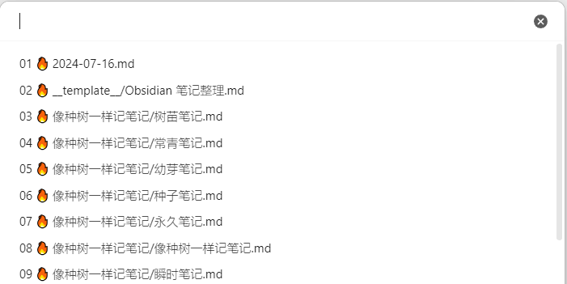
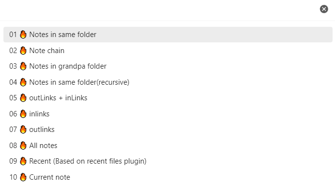

> 思想如流水，笔记如链条。添加前后置笔记，并在文件目录中排序查看。


## 为什么是 `Note Chain`

现代笔记提出的双链概念，让笔记像大脑一样，网状思考。像根系或河网一样星罗密布，不遗漏任何想法，根据笔记内在链接，我们又轻而易举地将每个想法拾起。

但是，当我们最终决定将观点整理成文章，想主题汇编成书籍时，我们不得不将这张网卷成一条主线。那为什么不一开始就为此做出一点努力呢？

当我像 `尼古拉斯·鲍曼` 一样，盯着蛮抽屉的笔记时，各类的抽屉、各种的笔记，标题、内容、标签、参考和日期在我脑中闪烁，我意识到：

> 线性输出需要线性输入。


为此，我将所有按顺序排列的笔记称为笔记链，并开发了 `Note Chain` 插件，旨在为笔记管理这张拼图，添上一小块。


## 如何创建笔记链？


`Note Chain` 通过元数据 `PrevNote` 和 `NextNote` 定义当前笔记的前置笔记和后置笔记。通过这种关系，将同一链条上的笔记串联起来。

- 前置笔记：排在当前笔记前面的笔记；
- 后置笔记：排在当前笔记后面的笔记；
- 头笔记：笔记链第一条笔记；
- 尾笔记：笔记链最后一条笔记；

`Note Chain` 提供了多个命令，帮助创建笔记链。

`Create New Note`：创建当前笔记的`前置/后置/头/尾/非链` 笔记，创建时选择类型，之后输入文件名，如果文件已存在，会跳转到该文件。这个命令可以替代 `Obsidian` 提供的 `Create New Note` 命令，建议将快捷键设置为 `Ctrl + N`；


`Move node up`：笔记链中上移当前笔记，`A-B-C-D-E` 变为 `A-C-B-D-E`，建议将快捷键设置为 `Alt + PgUp`；

`Move node down`：笔记链中下移当前笔记，`A-B-C-D-E` 变为 `A-B-D-C-E`，建议将快捷键设置为 `Alt + PgDn`

`Insert node of chain`：将当前笔记插入笔记链。首先按照不同的模式选择笔记组，再选择笔记作为锚点，最后选择当前笔记与锚点的关系。由于通常选择同目录笔记，可以在设置页 `Insert nde of chain: Default mode` 选择默认笔记组。建议将快捷键设置为 `Alt + I`。


`文件列表 Files` 中也提供了两个命令方便创建笔记链：

-  `Create next note`：创建当前笔记的后置文件；
- `Move as next note`：将当前笔记或文件夹设为某一笔记的后置笔记。对于笔记，在全部笔记中选择。对于文件夹，只选择同目录笔记。


以上介绍的方法都是为单个笔记设置节点。`Note Chain` 还提供了多个命令整理同一个文件夹内的笔记。

`Reset the chain of current folder` 将当前笔记所在文件夹内的所有笔记串成笔记链。可以根据名称文件名 `name`、创建时间`ctme`、修改时间`mtime`，通过正序 （`a to z`） 或逆序（`z to a`）创建笔记链，适合初始化。也可以基于已有笔记链 `chain`，适用于一个目录下有多个笔记链的情况。

`Reset note chain by longform` 和 `Reset longform scenes by note chain` 是一组相互成就的命令，将当前文件夹笔记的笔记链与 [[LongForm]] 插件的场景相对应。`Reset longform scenes by note chain` 在文件夹同名笔记中生成 `longform` 项目元数据，并将当前笔记链设置为其场景。可以通过 `Move line down` 和 `Move line up` 移动元数据中的单个或多个笔记顺序，或将笔记剪切到指定位置。然后通过 `Reset note chain by longform` 设置对应的笔记链。这组命令可以更方便地整理笔记。

`Note Chain 1.0.7` 还支持自动重塑文件夹内的笔记链。在 `设置` 页面勾选 `Auto build notechain of folder while open new file`，当打开笔记时，自己当当前文件夹内的笔记串成笔记链，类似于自动按 `chain` 执行 `Reset the chain of current folder` 。如果某些文件夹不需要自动重塑，可以在 `Ignore these folder` 中输入要跳过的文件夹，多个文件夹通过换行分割。

## 文件列表排序规则

在设置笔记链之后，在设置页开启 `Sort by chain in file explorer`，`文件列表Files` 中的文件将按笔记链顺序排序。


### 笔记排序规则

`markdown` 笔记（包括 `Excalidraw`）排序规则：

1. 对于 `文件列表` 中的每个目录，获取文件和文件夹排序 `A`；
2. 初始化新的排序 `B`；
3. 对 `A` 中的第一条笔记，获取其笔记链 `C`;
4. 更新 `A` 和 `B`：`B=B+A∩C`，`A=A-A∩C`。
5. 重复步骤3，直到`A` 中没有 `md` 笔记；
6. 得到笔记序列 `B`；

### 文件夹排序规则

文件夹排序规则：

1. 笔记序列 `B` 中的笔记索引值为 `0、1、2、...`；
2. 文件夹默认的索引为 `-1`；
3. 如果文件夹的同名笔记设置了元数据 `FolderPrevNote` 和 `FolderPrevNoteOffset`：
	- `FolderPrevNote` 是锚点笔记；
	- `FolderPrevNoteOffset` 是数字，默认为 `0.5`；
	- 目录索引值为：`FolderPrevNote + FolderPrevNoteOffset`；
4. 对文件和文件夹按索引进行排序；

例如，将 `文件夹C` 和 `文件夹D` 设置如下元数据：
- `文件夹C`：`FolderPrevNote: "[[笔记B]]"`，`FolderPrevNoteOffset:0.2`；
- `文件夹D`：`FolderPrevNote: "[[笔记B]]"`，`FolderPrevNoteOffset:0.6；

`文件列表 Files` 中的排序为：


设置文件夹排序，在 `文件列表/Files` 中右键点击目录，点击 `Move as next note`，选择非在哪个笔记之后。

### `canvas` 白板排序规则 

`canvas` 白板不能设置前后置笔记，而且它本来就是个文件，像文件夹一样为它新建同名笔记感觉容易冗余。但我忽然想到，往往是有了笔记之后，才会对白板的需求。所以，白板的排序规则为：

1. 在笔记之后创建同名白板，即白板排在同名笔记之后；
2. 如果一条笔记需要多个白板，新的白板按 `笔记文件名.xxx` 命名，即白板排在文件名按最后一个 `.` 截断后对应的笔记之后；

## 快速访问

`Note Chain` 提供了多个命令更方便地访问笔记。

`Open note`: 打开笔记。所有的笔记按修改时间排序，并且可以通过数字编码访问。



`Open and reveal note`：打开并定位笔记，笔记将在 `文件列表` 中间显示；

`Reveal current file in navigation`：在 `文件列表` 中定位笔记，笔记显示时居中，可以替换系统自带的命令；

`Open note smarter`：先选择笔记分组，再选择笔记。



`Move current file to another folder`：移动当前笔记，文件夹根据笔记的最新修改时间排序，因此优先移动到活跃中的目录。

`Open prev note`: 打开前置笔记，建议快捷键设为 `Alt+←`;

`Open next note`: 打开后置笔记，建议快捷键设为 `Alt+→`;

`Open prev note of right leaf`：打开右侧页面的前置笔记；

`Open next note of right leaf`：打开右侧页面的后置笔记；

最后这两个命令适合用于联动笔记，具体示例在[这里](http://mp.weixin.qq.com/s?__biz=MzI5MzMxMTU1OQ==&mid=2247486786&idx=1&sn=bda7acb189427ab44690e04289658225&chksm=ec75486adb02c17c64b9193c01197f6b44d57649d21fdc0f4f2dbbb5ec3823d862bf22acc4c8#rd)


## 其它功能

### 设置页

`Refresh dataview while open new file`：在打开新笔记时，是否刷新 `dataview`；

`Refresh tasks while open new file`：在打开新笔记时，是否刷新 `task`。

### 字数统计

`Register daily word count`：是否在修改笔记时记录当日笔记字数，字数统计类似于核心插件 `Word Count`。这一功能可以追踪笔记输出量。

```js
let nc = app.plugins.getPlugin('note-chain');
let note = nc.chain.current_note;
// 获取笔记指定日期的更新字数
nc.wordcout.get_new_words(note,'2024-07-15')

```

### 实用函数

```js
let nc = app.plugins.getPlugin('note-chain');
```

> `let note = nc.chain.get_last_daily_note()`

获取最近访问的日志笔记，优先级为：当前页面是否是日志笔记、右侧页面是否是日志笔记、历史笔记中的第1条日志笔记。

> `let leaf = nc.chain.get_neighbor_leaf(offset=-1)`

获取当前笔记左右侧的页面，`offset` 为负时表示左侧，为正时表示右侧。`leaf.view.file` 为对应的笔记。

> `let note = await nc.chain.sugguster_note()`

从库中选择一个笔记。

> `let func = nc.utils.get_tp_func(app, "tp.system.prompt")`

获取 `Templater` 插件提供的函数；

> `let func = awiat nc.utils.get_tp_func(app, "tp.user.func")`

获取 `Templater` 插件定义的用户函数；


## 安装

Note Chain 依赖以下插件：
- [[Templater]] + [[DataView]] + [[Recent Files]] + [[Tasks]]

### 从插件社区安装

1. Obsidian 中，`ctrl+,` 打开`设置`；
2. 在`社区插件` 中点击`浏览`；
4. 搜索并选择 `Note Chain` ；
5. 点击安装并启用；

你也可以在 [obsidian plugins note-chain](https://obsidian.md/plugins?search=note-chain) 安装。

### 手动安装

1. 点击项目最新 [发布页](https://github.com/zigholding/obsidian-notechain-plugin/releases), 下载 `main.js`、 `manifest.json`和 `styles.css` (或者zip压缩文件)；
2. 将文件复制到你的 `obsidian` 库中 `[your vault]/.obsidian/plugins/note-chain/`；
3. 重启 `Obsidian` 或刷新插件列表，你将看到这一插件；
4. 在插件列表中，启用 `Note Chain`；

你也可以从[百度云盘]( [BaiduCloudDisk](https://pan.baidu.com/s/1mR71B9lLE9CgZwcnfyLOEg?pwd=khum))下载这些文件。

